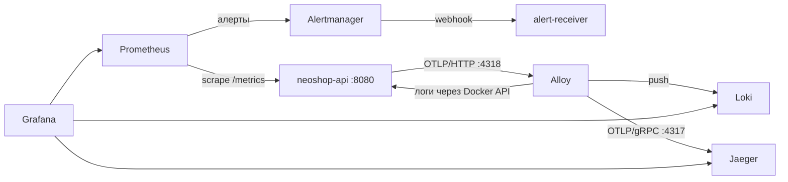

# Лаба 2 — Полный мониторинг API-бэкенда NeoShop

Мониторинг **API-бэкенда NeoShop** (порт 8080 из архитектуры Лабы 1): метрики и логи — в Grafana, трейсы — в Jaeger, алерты — через Alertmanager. Всё поднимается одним `docker compose`, версии образов зафиксированы тегами.

Подробное описание решений — в разделе «Лабораторная работа 2» отчёта [`../lab1/report.md`](../lab1/report.md).

## Запуск

```bash
cd lab-2
cp .env.example .env          # задать свой GRAFANA_ADMIN_PASSWORD
docker compose up -d --build
```

Остановить и удалить стенд (данные в томах тоже):

```bash
docker compose down -v
```

| Что | Адрес |
| --- | --- |
| NeoShop API: страница с кнопками | http://localhost:8080 |
| Prometheus (targets, alerts) | http://localhost:9090 |
| Grafana (логин `admin`, пароль из `.env`) → дашборд **NeoShop → NeoShop API — RED** | http://localhost:3000 |
| Jaeger UI | http://localhost:16686 |
| Alertmanager | http://localhost:9093 |
| Alloy UI (граф компонентов) | http://localhost:12345 |

## Состав стенда

| Сервис | Образ | Роль |
| --- | --- | --- |
| `neoshop-api` | сборка из [`app/`](app/) (`python:3.12.14-slim`) | Заглушка API: `/metrics`, JSON-логи с `trace_id`, OpenTelemetry |
| `prometheus` | `prom/prometheus:v3.15.0` | Сбор метрик раз в 5 с, вычисление правил алертов |
| `grafana` | `grafana/grafana:13.2.3` | Дашборд RED, Explore по логам и трейсам. Источники данных и дашборд — через provisioning |
| `loki` | `grafana/loki:3.7.8` | Хранение логов |
| `alloy` | `grafana/alloy:v1.20.1` | Агент: логи контейнеров → Loki, OTLP-трейсы → Jaeger |
| `jaeger` | `jaegertracing/jaeger:2.20.0` | Хранение и UI трейсов (v2, all-in-one, в памяти) |
| `alertmanager` | `prom/alertmanager:v0.34.1` | Группировка и доставка алертов |
| `alert-receiver` | `python:3.12.14-slim` + [`receiver.py`](alert-receiver/receiver.py) | Webhook-получатель: пишет алерты в свой лог |

Потоки данных:



## Кнопки заглушки

| Кнопка | Эндпоинт | Что происходит |
| --- | --- | --- |
| Создать ошибку | `POST /api/payments` | Платёжный шлюз «падает» → 502, спаны `POST /api/payments` и `payment-gateway.charge` со статусом error, лог `level=error` |
| Создать задержку | `GET /api/products/search` | Вложенный спан `slow-dependency` (OpenSearch) спит 1–3 с |
| Нагрузка | `POST /api/load?seconds=60&rps=30` | Сервис 60 с шлёт себе ~30 rps на `/api/products`, `/api/products/{id}`, `/api/cart/items` |
| Обычный запрос | `GET /api/products` | Быстрый ответ каталога |

## Метрики на дашборде и почему

Сервис отдаёт на `/metrics` три метрики RED с метками `method` и `route`; `route` — **шаблон пути** (`/api/products/{product_id}`), а не сам путь, иначе каждый id товара стал бы отдельным временным рядом.

| Панель | PromQL | Зачем |
| --- | --- | --- |
| **Rate** — запросов в секунду по эндпоинтам | `sum by (route) (rate(http_requests_total[1m]))` | Нагрузка на сервис и её распределение: видно, какой эндпоинт растёт при распродаже или атаке |
| **Errors** — доля 5xx | `(sum(rate(http_request_errors_total[1m])) or vector(0)) / sum(rate(http_requests_total[1m]))` | Доля, а не число: 10 ошибок при 10 запросах и при 10 000 — разные ситуации. `or vector(0)` — чтобы без ошибок был 0, а не пустой график |
| **Duration** — p95 времени ответа | `histogram_quantile(0.95, sum by (le) (rate(http_request_duration_seconds_bucket[1m])))` + то же `by (le, route)` | p95 вместо среднего: среднее «размазывает» медленные запросы по быстрым, p95 показывает, сколько ждёт заметная доля покупателей. Бакеты гистограммы частые в зоне 1–3 с, чтобы квантиль считался точно |

## Алерты и почему такие

Правила — [`configs/prometheus/alerts.yml`](configs/prometheus/alerts.yml). Порог выбран **между нормой и аномалией** (норма стенда: RPS < 1, ошибок 0, p95 ≈ 0,05–0,1 с). `for: 30s` — условие должно держаться 30 с подряд (pending → firing), чтобы одиночный выброс не поднимал дежурного; в проде ставят 2–10 мин.

| Алерт | Условие | Severity | Что ловит и чем грозит | Кнопка |
| --- | --- | --- | --- | --- |
| `NeoShopHighErrorRate` | доля 5xx > 5% | critical | Падают оплаты и заказы — прямые потери выручки. 5%, а не 25%: при 25% падает каждая четвёртая оплата, это уже авария | «Создать ошибку» ×5–10 |
| `NeoShopTrafficSpike` | суммарный RPS > 10 | warning | Распродажа, бот/парсер, ретраи клиентов или DDoS — риск упереться в CPU и пулы соединений к PostgreSQL/Redis. 10 — в 10 раз выше нормы и ниже уровня «Нагрузки» (~30 rps) | «Нагрузка» |
| `NeoShopHighLatencyP95` | p95 > 1 с | warning | Покупатель замечает задержку, растут брошенные корзины; часто предвестник ошибок (медленная зависимость → таймауты → 5xx) | «Создать задержку» ×5 |

Alertmanager ([`configs/alertmanager/alertmanager.yml`](configs/alertmanager/alertmanager.yml)) группирует по `alertname`, ждёт 10 с перед первой отправкой и шлёт webhook в `alert-receiver` — в том числе `resolved`. Сработавшие алерты видны:

```bash
docker compose logs -f alert-receiver
```

или в Grafana → Explore → Loki: `{service="alert-receiver"}`.

## Логи и трейсы — как искать

- Ошибки: Grafana → Explore → Loki → `{service="neoshop-api", level="error"}`.
- По трейсу: `{service="neoshop-api"} | trace_id="<id>"` — `trace_id` хранится в structured metadata, а не в метке.
- Из строки лога — кнопка **«Открыть в Jaeger»** (derived field) открывает трейс рядом.
- В Jaeger UI: Service `neoshop-api` → Tags `error=true` (ошибки) или Min Duration `1s` (задержка). Или `http://localhost:16686/trace/<trace_id>`.

## Грабли, на которые наступили

- **Jaeger 2.21+ убрал v1 HTTP API**, а источник данных Jaeger в Grafana 13 его использует (health check → 404). Поэтому Jaeger закреплён на `2.20.0`.
- **Grafana 13 не перечитала изменённый JSON дашборда сама** — помогает перезапуск Grafana или `POST /api/admin/provisioning/dashboards/reload`.
- **Jaeger хранит трейсы в памяти**: после рестарта контейнера старые трейсы пропадают, и ссылка из старого лога даёт 404.
- **Alloy по умолчанию ищет новые контейнеры раз в минуту** — после пересоздания сервиса логи появлялись с задержкой; `refresh_interval` уменьшен до 10 с.

## Структура

```
lab-2/
├── README.md
├── docker-compose.yml
├── .env.example                 # GRAFANA_ADMIN_PASSWORD (сам .env не коммитится)
├── app/                         # заглушка NeoShop API
│   ├── main.py
│   ├── requirements.txt
│   └── Dockerfile
├── alert-receiver/receiver.py   # webhook-получатель алертов
├── configs/
│   ├── prometheus/{prometheus.yml, alerts.yml}
│   ├── alertmanager/alertmanager.yml
│   ├── alloy/config.alloy
│   └── grafana/
│       ├── provisioning/{datasources,dashboards}/
│       └── dashboards/neoshop-red.json
└── screenshots/
```
