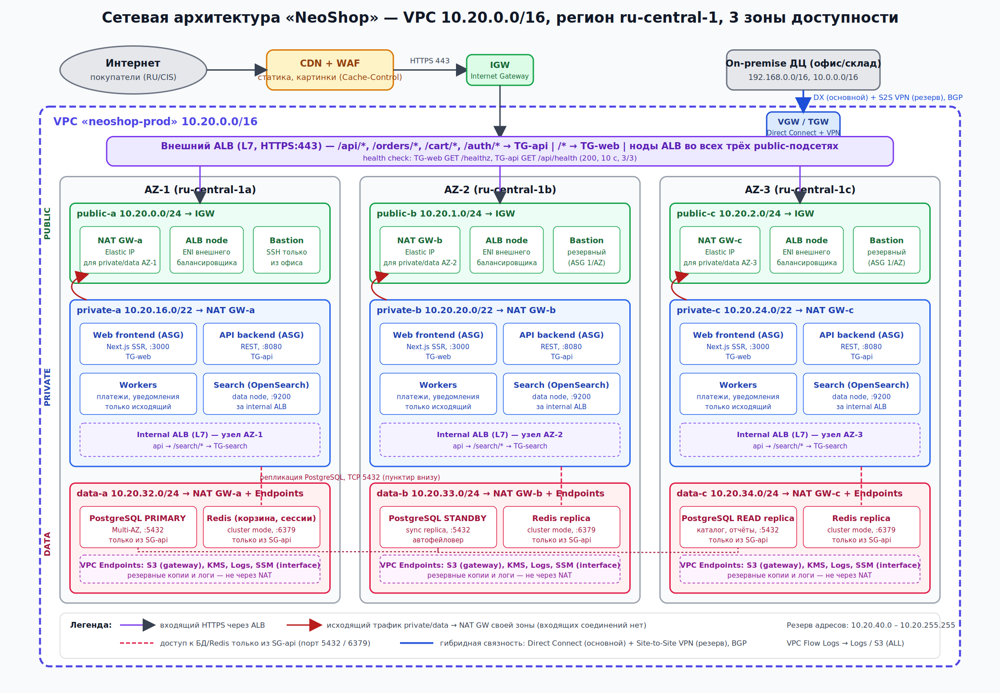

# Лабораторная работа 1 — Проектирование сетевой архитектуры облака

**Проект:** интернет-магазин «NeoShop»
**Роль:** DevOps-инженер
**Схема:** [`scheme/vpc.png`](scheme/vpc.png) (исходник — [`scheme/vpc.svg`](scheme/vpc.svg))

---

## 0. Описание сервиса

**Название сервиса:** NeoShop

**Тип сервиса:** интернет-магазин (электроника и товары для дома)

**Целевая аудитория:** розничные покупатели из России и СНГ, 18–55 лет; пик нагрузки — вечером и в сезонные распродажи (до ×5 к обычному трафику). Отдельно — сотрудники склада и колл-центра, работающие из офиса компании.

**Основные пользовательские сценарии:**

1. Просмотр каталога и поиск товаров (фильтры, полнотекстовый поиск, картинки).
2. Корзина и оформление заказа с онлайн-оплатой через внешний платёжный шлюз.
3. Личный кабинет: вход, история заказов, отслеживание доставки.
4. Служебный сценарий: менеджеры из офиса обновляют остатки и цены через админ-панель.

**Состав сервисов:**

| Сервис | Назначение | Особенности (что важно для проектирования) |
| --- | --- | --- |
| Web-фронтенд (Next.js SSR) | Публичная витрина, страницы товаров, корзина | HTTP/HTTPS, порт 3000; stateless; статика и изображения отдаются через CDN с `Cache-Control` |
| API-бэкенд (REST) | Бизнес-логика: каталог, корзина, заказы, авторизация | Порт 8080; пути `/api/*`, `/orders/*`, `/cart/*`, `/auth/*`; горизонтально масштабируется; единственный клиент БД |
| Поиск (OpenSearch) | Полнотекстовый поиск и фильтрация каталога | Порт 9200, только внутри VPC, доступ от API через внутренний балансировщик |
| PostgreSQL (Multi-AZ) | Основное хранилище: пользователи, заказы, товары | Порт 5432; **не должна быть доступна из интернета**; primary + синхронная standby + read-replica |
| Redis (cluster) | Сессии, корзина, кэш каталога | Порт 6379; только из API; реплики в каждой AZ |
| Workers (фоновые задачи) | Подтверждение оплаты у платёжного шлюза, e-mail/SMS-уведомления, обработка изображений | Только **исходящий** интернет (платёжный шлюз, SMTP-провайдер); входящих соединений нет |
| Bastion / SSM | Административный доступ | SSH только из сети офиса; в production предпочтительнее Session Manager без открытых портов |

**Требования к отказоустойчивости (из ТЗ):** три зоны доступности; фронтенд и API — через балансировщик; у приватных подсетей только исходящий интернет; ни одного Single Point of Failure.

---

## 1. Обоснование CIDR

**Выбран блок `10.20.0.0/16`** (65 536 адресов) из приватного диапазона RFC 1918.

**Почему /16, а не меньше.** /16 — стандарт для production-VPC: он позволяет нарезать подсети трёх типов на три зоны и оставить больше половины адресов в резерве под будущие подсети (Kubernetes-кластер с pod-сетью, отдельная подсеть для аналитики, staging). Маска /20 (4 096 адресов) формально минимум, но при 9 подсетях по /24 она была бы исчерпана сразу, а при росте пришлось бы добавлять вторичный CIDR, что усложняет маршрутизацию и правила Security Groups.

**Отсутствие пересечений.** Инвентаризация существующих сетей компании:

| Сеть | Диапазон | Назначение |
| --- | --- | --- |
| Офисная сеть | `192.168.0.0/16` | рабочие станции, Wi-Fi |
| Серверная on-premise | `10.0.0.0/16` | 1С, склад, файловые серверы |
| VPN-пул сотрудников | `10.8.0.0/24` | клиентские VPN-подключения |
| Dev/test-VPC (существующая) | `10.10.0.0/16` | среда разработки |
| **Новая VPC (prod)** | **`10.20.0.0/16`** | **МаркетГрад** |

`10.20.0.0/16` не входит ни в один из перечисленных диапазонов, поэтому при подключении к on-premise через Direct Connect/VPN маршруты не конфликтуют, а трафик между сетями не требует NAT. Для будущих VPC (staging) заранее зарезервирован `10.30.0.0/16`, шаг /16 между VPC исключает случайные пересечения.

Правило нарезки внутри VPC: третий октет кодирует тип подсети (`0–2` — public, `16–27` — private, `32–34` — data), а зона доступности — последовательный номер внутри типа. Это удобно читать в таблицах маршрутизации и Flow Logs.

---

## 2. Таблица подсетей

| Зона | Подсеть | CIDR | Тип | Маршрут по умолчанию | Что размещается |
| --- | --- | --- | --- | --- | --- |
| AZ1 (ru-central-1a) | public-a | `10.20.0.0/24` | public | IGW | ALB node, NAT GW-a, Bastion |
| AZ1 | private-a | `10.20.16.0/22` | private | NAT GW-a | Web, API, Workers, Search, internal ALB |
| AZ1 | data-a | `10.20.32.0/24` | data | NAT GW-a + VPC Endpoints | PostgreSQL primary, Redis |
| AZ2 (ru-central-1b) | public-b | `10.20.1.0/24` | public | IGW | ALB node, NAT GW-b, Bastion |
| AZ2 | private-b | `10.20.20.0/22` | private | NAT GW-b | Web, API, Workers, Search, internal ALB |
| AZ2 | data-b | `10.20.33.0/24` | data | NAT GW-b + VPC Endpoints | PostgreSQL standby, Redis replica |
| AZ3 (ru-central-1c) | public-c | `10.20.2.0/24` | public | IGW | ALB node, NAT GW-c, Bastion |
| AZ3 | private-c | `10.20.24.0/22` | private | NAT GW-c | Web, API, Workers, Search, internal ALB |
| AZ3 | data-c | `10.20.34.0/24` | data | NAT GW-c + VPC Endpoints | PostgreSQL read-replica, Redis replica |
| — | резерв | `10.20.40.0` – `10.20.255.255` | — | — | будущие подсети (k8s, аналитика) |

Приватным подсетям выдано по /22 (1 019 адресов): именно там живут автомасштабируемые группы (ASG) приложений, которым в распродажу нужно быстро расти. Публичные и data-подсети — по /24: в них счётное число ресурсов (нод балансировщика, шлюзов, экземпляров БД).

### Таблицы маршрутизации

**rt-public** (общая для трёх публичных подсетей):

| Назначение | Цель |
| --- | --- |
| `10.20.0.0/16` | local |
| `192.168.0.0/16`, `10.0.0.0/16` | VGW (Direct Connect / VPN) |
| `0.0.0.0/0` | **igw-marketgrad** |

**rt-private-a / -b / -c** (отдельная таблица на каждую зону — иначе NAT становится единой точкой отказа):

| Назначение | Цель |
| --- | --- |
| `10.20.0.0/16` | local |
| `192.168.0.0/16`, `10.0.0.0/16` | VGW |
| `pl-s3` (prefix list S3) | vpce-s3 (gateway endpoint) |
| `0.0.0.0/0` | **nat-gw-{a\|b\|c}** своей зоны |

**rt-data-a / -b / -c:**

| Назначение | Цель |
| --- | --- |
| `10.20.0.0/16` | local |
| `pl-s3` | vpce-s3 (gateway endpoint) |
| `0.0.0.0/0` | **nat-gw-{a\|b\|c}** своей зоны |

**Обоснование выбора для data-подсетей: NAT Gateway + VPC Endpoints.** Основной трафик БД наружу — это резервные копии в объектное хранилище (S3), шифрование ключами KMS, отправка логов и метрик и управление через SSM. Для всех этих сервисов подняты VPC Endpoints (gateway для S3, interface для KMS/Logs/SSM): трафик не покидает сеть облака, не оплачивается по тарифу NAT (важно для бэкапов объёмом в десятки ГБ) и не зависит от работоспособности NAT. Маршрут `0.0.0.0/0 → NAT` в data-подсетях оставлен только для редких операций — обновления пакетов ОС на self-hosted-узлах и обращений к репозиториям расширений. Security Group БД при этом ограничивает исходящие соединения, так что маршрут через NAT не превращается в канал утечки. Маршрута на on-premise у data-подсетей **нет** намеренно: администрирование БД идёт через bastion/SSM из private-подсети.

---

## 3. Схема сети

Файлы: `scheme/vpc.png` (растровая версия), `scheme/vpc.svg` (векторный исходник).

Чтение схемы:

- **Сверху вниз** — путь пользовательского запроса: Интернет → CDN/WAF → IGW → внешний ALB → приватная подсеть (Web/API) → data-подсеть (PostgreSQL/Redis). Ни один слой не пропускает трафик мимо соседнего.
- **Три колонки** — зоны доступности; в каждой одинаковый набор: public / private / data, свой NAT Gateway, свой узел внешнего и внутреннего ALB.
- **Красные стрелки** — исходящий трафик приватных подсетей в свой NAT (входящих соединений через NAT быть не может).
- **Пунктир снизу** — репликация PostgreSQL между зонами; для неё в будущем понадобится NLB (см. раздел 4).
- **Справа** — гибридная связность с on-premise (Direct Connect + резервный VPN).

---

## 4. Балансировщики

| Сервис | Тип балансировщика | Уровень | Правило / стратегия |
| --- | --- | --- | --- |
| Web-фронтенд + API (публичный вход) | **ALB** `alb-public` (internet-facing, ноды в public-a/b/c) | **L7** | Listener 443 (TLS-терминация, HTTP→HTTPS redirect на 80). Правила по приоритету: 1) `/api/*`, `/orders/*`, `/cart/*`, `/auth/*` → **TG-api**; 2) `/admin/*` → TG-api **только с IP офиса** (иначе 403); 3) default `/*` → **TG-web**. Стратегия TG-api — *Least Outstanding Requests*, TG-web — *Round Robin* |
| Поиск (OpenSearch) | **ALB** `alb-internal-search` (internal, ноды в private-a/b/c) | **L7** | Listener 9200 (HTTP внутри VPC); `/search/*` от API → **TG-search**; *Least Outstanding Requests*; Security Group разрешает вход только от SG-api |
| Репликация PostgreSQL / PgBouncer | **NLB** (internal) — *описан, не настроен* | **L4** | TCP 5432, Flow Hash по 5-tuple; сохраняет IP клиента, нет разбора содержимого |

### Обоснование через уровень

- **Публичный вход — ALB (L7).** Требуется маршрутизация *по пути URL* (`/api/*` на одну группу серверов, остальное на другую), редирект HTTP→HTTPS, терминация TLS одним сертификатом, добавление заголовка `X-Forwarded-For`, интеграция с WAF, а также ограничение `/admin/*` по источнику. Всё это — операции над HTTP-запросом, которые невозможны на L4: NLB видит только IP-заголовок и TCP-порт и не знает, что такое путь.
- **Поиск — внутренний ALB (L7).** OpenSearch общается по HTTP, поэтому health check может проверять реальный ответ `/_cluster/health`, а не просто открытый порт. Балансировщик внутренний (без публичного IP), так что кластер поиска никогда не виден из интернета.
- **Репликация БД — NLB (L4).** Репликационный поток PostgreSQL — это бинарный протокол поверх TCP, долгоживущие соединения и чувствительность к задержке. ALB его разобрать не сможет (это не HTTP), а NLB работает на уровне соединений, добавляет микросекунды задержки и переживает миллионы соединений. В текущей лабе managed-PostgreSQL сам управляет фейловером через DNS-эндпоинт, поэтому NLB не настраивался; понадобится он при переходе на self-hosted-кластер с Patroni/PgBouncer.

### Health checks

| Target group | Протокол / путь | Интервал | Порог healthy / unhealthy | Таймаут | Успешный код |
| --- | --- | --- | --- | --- | --- |
| TG-web (порт 3000) | HTTP `GET /healthz` | 10 с | 3 / 3 | 5 с | 200 |
| TG-api (порт 8080) | HTTP `GET /api/health` (проверяет соединение с БД и Redis) | 10 с | 3 / 3 | 5 с | 200 |
| TG-search (порт 9200) | HTTP `GET /_cluster/health` | 15 с | 2 / 3 | 5 с | 200 (статус green/yellow) |
| TG-pg (гипотетический NLB) | TCP 5432 | 10 с | 3 / 3 | 6 с | TCP-handshake |

`/api/health` возвращает 200 только при рабочем коннекте к БД и Redis: если у узла API «отвалилась» сеть до data-подсети, он выводится из ротации, а не отдаёт пользователям 500. Для TG-web и TG-api включён `deregistration_delay = 30 с` (connection draining), чтобы при масштабировании вниз не рвать оформление заказа.

### Почему такие стратегии

- **TG-web — Round Robin.** SSR-рендеринг страниц однородный и короткий, узлы одного размера; простая равномерная раздача даёт предсказуемый результат.
- **TG-api — Least Outstanding Requests.** Запросы к API неоднородны: `GET /api/products` — миллисекунды, `POST /orders` с обращением к платёжному шлюзу — секунды. Round Robin в такой ситуации «складывает» долгие запросы на один узел; выбор узла с наименьшим числом незавершённых запросов сглаживает нагрузку.
- **Sticky sessions выключены.** Сессии и корзина хранятся в Redis, поэтому любой узел API обслужит любого пользователя, и балансировщик может свободно перераспределять трафик при отказе узла.

**Контрольная точка 2 (проверка маршрутизации):** правила ALB обрабатываются по приоритету; все API-префиксы стоят выше default-правила, поэтому запрос `/api/products` никогда не попадёт на TG-web, а запрос `/product/123` (страница витрины) не начинается ни с одного API-префикса и уходит на TG-web. Спорный случай — статика Next.js `/_next/static/*`: она не пересекается с `/api/*`, попадает на TG-web и дополнительно кэшируется CDN.

---

## 5. Связность и резервирование

### Internet Gateway

Один IGW `igw-marketgrad` привязан к VPC и прописан как `0.0.0.0/0` в **rt-public**. IGW — горизонтально масштабируемый и избыточный компонент облака, поэтому его не нужно дублировать. К нему имеют доступ только ресурсы публичных подсетей с публичными IP: ноды ALB, NAT Gateway и bastion. Приложения и БД публичных IP не имеют вовсе, следовательно принять входящее соединение из интернета физически не могут.

### NAT Gateway — по одному в каждой зоне

Развёрнуты `nat-gw-a`, `nat-gw-b`, `nat-gw-c` в public-a/b/c, каждый со своим Elastic IP, и три отдельные таблицы маршрутизации для private- и data-подсетей, направляющие `0.0.0.0/0` в NAT **своей** зоны.

**Зачем три, а не один.** NAT Gateway — зональный ресурс: если положить один NAT в AZ1 и направить в него все приватные подсети, то при недоступности AZ1 приложения в AZ2 и AZ3 продолжат работать, но потеряют исходящий интернет — воркеры не смогут подтвердить оплату у платёжного шлюза, не уйдут уведомления, не обновятся зависимости. Формально сервис «жив», фактически заказы не оформляются. Это классический Single Point of Failure, замаскированный под экономию. Дополнительный плюс зональной схемы: трафик не ходит между зонами, за что облако берёт отдельную плату и добавляет задержку.

Три Elastic IP NAT-шлюзов передаются платёжному провайдеру и SMTP-сервису для добавления в allow-list — это ещё одна причина, почему исходящий трафик обязан идти через фиксированные NAT, а не через случайные публичные адреса.

### Гибридная связность с on-premise ДЦ

Компания держит в собственном ДЦ склад, 1С и колл-центр (`10.0.0.0/16`, офис `192.168.0.0/16`). Менеджерам нужен доступ к админ-панели и read-replica для отчётов, а воркерам — к API склада.

**Основной канал — Direct Connect (выделенный канал).** Порт 1 Гбит/с на площадке провайдера, private virtual interface к Virtual Private Gateway (`vgw-marketgrad`). Даёт стабильную задержку и полосу, трафик не идёт через публичный интернет. Анонсы маршрутов — через BGP: облако анонсирует `10.20.0.0/16`, ДЦ — `10.0.0.0/16` и `192.168.0.0/16`.

**Запасной канал — Site-to-Site VPN.** Два IPsec-туннеля через интернет к тому же VGW, терминируются на двух разных маршрутизаторах ДЦ (два разных провайдера в ДЦ). Настроен динамический BGP, а не статические маршруты.

**Как работает резервирование.**

1. Оба канала подключены к одному VGW и анонсируют одинаковые префиксы по BGP.
2. Облако по умолчанию предпочитает маршруты Direct Connect перед VPN; со стороны ДЦ предпочтение задаётся через `local preference` (DX выше) и AS-path prepend на VPN-сессиях.
3. При падении DX (обрыв волокна, авария на площадке провайдера) BGP-сессия рвётся, маршруты снимаются за время hold-timer (~30–90 с; с BFD — единицы секунд), и трафик автоматически переходит на VPN. Возврат на DX — автоматический, после восстановления сессии.
4. Второй уровень резерва — два VPN-туннеля на разных устройствах ДЦ, так что отказ одного маршрутизатора не отключает резерв.
5. Для полной независимости от площадки провайдера при росте бизнеса планируется второй DX-порт в другой location (resilient DX).

Ограничение, о котором нужно помнить: VPN-туннель даёт ~1,25 Гбит/с и работает через интернет с плавающей задержкой. Поэтому бизнес-процесс расставлен по приоритетам: при работе на резерве синхронизация остатков со складом идёт, а тяжёлые ночные выгрузки для аналитики ставятся на паузу.

### Итог по SPOF

| Компонент | Резерв |
| --- | --- |
| Внешний ALB | ноды во всех трёх public-подсетях, управляется облаком |
| Web / API / Workers | ASG min = 3 (по одному в каждой AZ), автозамена упавших узлов |
| NAT Gateway | по одному на AZ, независимые таблицы маршрутизации |
| PostgreSQL | primary (AZ1) + синхронная standby (AZ2, автофейловер) + read-replica (AZ3) |
| Redis | cluster mode, реплики во всех трёх AZ |
| Поиск | 3 data-node, шарды с репликой на другой AZ |
| Связь с ДЦ | Direct Connect + 2 VPN-туннеля, BGP |
| Bastion | ASG по 1 узлу в каждой AZ (или SSM без bastion) |

---

## 6. Безопасность

### Security Groups (stateful)

Принцип: **ссылки на Security Group вместо CIDR** везде, где источник — ресурс внутри VPC. При масштабировании ASG новые узлы автоматически попадают под правило, а правило «разрешить от SG-api» точнее, чем «разрешить от всей private-подсети», где живут ещё и воркеры и поиск.

**SG-alb-public** (внешний ALB)

| Направление | Протокол/порт | Источник / назначение | Комментарий |
| --- | --- | --- | --- |
| Ingress | TCP 443 | `0.0.0.0/0` (или prefix list CDN) | HTTPS от пользователей |
| Ingress | TCP 80 | `0.0.0.0/0` | только для редиректа на 443 |
| Egress | TCP 3000 | SG-web | к фронтенду |
| Egress | TCP 8080 | SG-api | к API |

**SG-web** (фронтенд)

| Направление | Протокол/порт | Источник / назначение | Комментарий |
| --- | --- | --- | --- |
| Ingress | TCP 3000 | SG-alb-public | только от балансировщика |
| Ingress | TCP 22 | SG-bastion | администрирование |
| Egress | TCP 443 | `0.0.0.0/0` | CDN, внешние API виджетов (через NAT) |
| Egress | TCP 8080 | SG-api | SSR ходит в API напрямую внутри VPC |

**SG-api** (API-бэкенд и воркеры)

| Направление | Протокол/порт | Источник / назначение | Комментарий |
| --- | --- | --- | --- |
| Ingress | TCP 8080 | SG-alb-public, SG-web | только от ALB и фронтенда |
| Ingress | TCP 22 | SG-bastion | администрирование |
| Egress | TCP 5432 | SG-db | PostgreSQL |
| Egress | TCP 6379 | SG-redis | Redis |
| Egress | TCP 9200 | SG-alb-internal-search | поиск через внутренний ALB |
| Egress | TCP 443 | `0.0.0.0/0` | платёжный шлюз, SMTP-провайдер API, обновления (через NAT) |

**SG-db** (PostgreSQL)

| Направление | Протокол/порт | Источник / назначение | Комментарий |
| --- | --- | --- | --- |
| Ingress | TCP 5432 | **SG-api** | единственный клиент |
| Ingress | TCP 5432 | SG-db (self) | репликация между узлами кластера |
| Ingress | TCP 5432 | SG-bastion | миграции и обслуживание |
| Egress | TCP 5432 | SG-db (self) | репликация |
| Egress | TCP 443 | prefix list S3, SG-vpce | бэкапы, KMS, логи через endpoints |

Никаких `0.0.0.0/0` во входящих правилах, никаких ссылок на SG-web или на CIDR подсетей — фронтенд и воркеры, даже находясь в той же приватной сети, до БД не достучатся. **Контрольная точка 3 выполнена.**

**SG-redis** — аналогично SG-db: ingress TCP 6379 только от SG-api и self.

**SG-nat.** У NAT Gateway как у managed-ресурса нет собственной Security Group — фильтрация выполняется на исходящих правилах SG источников (SG-api, SG-web, SG-db) и на Network ACL публичной подсети. Если бы использовался NAT-instance, его SG выглядела бы так:

| Направление | Протокол/порт | Источник / назначение | Комментарий |
| --- | --- | --- | --- |
| Ingress | TCP 80, 443 | `10.20.16.0/20`, `10.20.32.0/22` | только от private/data-подсетей своей VPC |
| Ingress | UDP 123 | те же | NTP |
| Egress | TCP 80, 443, UDP 123 | `0.0.0.0/0` | в интернет |

Входящих правил из интернета у NAT нет: stateful-механизм пропускает обратно только ответы на инициированные изнутри соединения.

**SG-bastion:** ingress TCP 22 только с `192.168.0.0/16` (офис) через Direct Connect/VPN; из интернета порт 22 закрыт. Целевое состояние — отказ от bastion в пользу SSM Session Manager через interface-endpoint, тогда во всей VPC не остаётся ни одного открытого административного порта.

### Network ACL (дополнительный, stateless слой)

На data-подсетях: разрешить входящие TCP 5432/6379 только из `10.20.16.0/20` (все private-подсети), исходящие ephemeral-порты 1024–65535 туда же и в prefix list S3; всё остальное — deny. NACL дублирует защиту Security Groups: даже ошибочное правило `0.0.0.0/0` в SG-db не откроет БД наружу.

### VPC Flow Logs

Включены на уровне **всей VPC** с фильтром `ALL` (accepted + rejected), интервал агрегации 1 минута, назначение — CloudWatch Logs (оперативный анализ, retention 30 дней) и S3 (долговременное хранение, retention 1 год для требований платёжной безопасности). Формат расширен полями `pkt-srcaddr`, `pkt-dstaddr`, `tcp-flags`, `flow-direction`, `traffic-path`.

**Зачем нужны и что позволяют обнаружить:**

- **Аудит доступа к БД.** Запрос «все `ACCEPT` на порт 5432 с адресов не из SG-api» должен возвращать ноль строк. Если не возвращает — где-то ошибка в правилах.
- **Сканирование и подбор.** Серии `REJECT` на разные порты с одного внешнего IP на ALB или bastion — признак сканирования; алерт в CloudWatch.
- **Утечки и C2-трафик.** Исходящие соединения с приватных узлов на неизвестные внешние адреса/порты (не 443 к платёжному шлюзу и SMTP) — сигнал компрометации.
- **Отладка связности.** Когда деплой «не видит базу», Flow Logs сразу показывают, режет ли трафик SG (нет записи `ACCEPT`), NACL (`REJECT`) или проблема на уровне приложения (`ACCEPT` есть, ответа нет).
- **Контроль стоимости.** Поле `traffic-path` показывает, какой трафик пошёл через NAT вместо VPC Endpoint — можно найти забытый бэкап, уходящий через NAT за деньги.
- **Расследование инцидентов.** Полная история «кто с кем говорил» за год — основа для post-mortem и требований регуляторов по хранению данных карт.

Ограничение Flow Logs — они фиксируют метаданные потока, а не содержимое пакетов; для глубокого разбора трафика нужен Traffic Mirroring, который здесь не требуется.

---

## 7. Выводы

**Что запомнили.**

- Сеть проектируется «слоями изоляции», а не «подсетями ради подсетей»: public — только точки входа и шлюзы, private — код, data — состояние. Каждый слой видит только соседний.
- Отказоустойчивость — это свойство **каждого** компонента, а не только серверов приложений. Один NAT, один bastion или одна таблица маршрутизации на три зоны сводят на нет весь Multi-AZ.
- Уровень балансировщика диктуется тем, что нужно *видеть* в трафике: маршрутизация по URL и терминация TLS — L7 (ALB); сырой TCP, задержка, сохранение IP клиента — L4 (NLB).
- Security Groups, ссылающиеся друг на друга, надёжнее CIDR-правил: они переживают автомасштабирование и не открывают лишнего внутри одной подсети.

**Каких ошибок избежали.**

- БД в публичной подсети и/или с правилом `0.0.0.0/0` на 5432.
- Один NAT Gateway на все зоны (SPOF и межзональный трафик).
- Единая таблица маршрутизации для всех private-подсетей.
- Маска /20 «потому что минимум» — с девятью подсетями она бы закончилась в день запуска.
- Статические маршруты на VPN вместо BGP — без BGP автоматическое переключение с Direct Connect на VPN не работает.
- Round Robin для неоднородных API-запросов.
- Пересечение с dev-VPC `10.10.0.0/16` и серверной сетью `10.0.0.0/16` — проверили инвентарь до выбора CIDR.

**Что нового узнали.**

- VPC Endpoints для data-подсетей — это не только безопасность, но и деньги: бэкапы через NAT стоят ощутимо, через gateway-endpoint S3 — бесплатно.
- У managed NAT Gateway нет собственной Security Group; фильтрация строится на SG источников и NACL.
- Flow Logs полезны не только для безопасности, но и как инструмент отладки «почему сервис А не видит сервис Б» и контроля расходов через поле `traffic-path`.
- BGP-атрибуты (`local preference`, AS-path prepend) — именно тот механизм, который делает резервный канал действительно автоматическим.

---

## 8. Чек-лист самопроверки

- [x] Сервис описан: название, тип, аудитория, сценарии, состав систем.
- [x] CIDR-блок: маска /16, без пересечений с существующими сетями.
- [x] Подсети: по одной public + private + data в каждой из трёх зон доступности.
- [x] Маршрутизация: публичные → IGW, приватные → NAT, data → NAT + Endpoints.
- [x] Балансировщик выбран корректно по уровню (L4/L7) — обосновано в разделе 4.
- [x] Health checks настроены для всех групп серверов.
- [x] NAT Gateway — в каждой зоне доступности (нет SPOF).
- [x] БД не в публичной подсети, доступна только API-бэкенду.
- [x] VPC Flow Logs включены.
- [x] Резервирование каналов описано (Direct Connect + Site-to-Site VPN, BGP).
- [x] Схема сети и документация маршрутов приложены.
- [x] Ресурсы в реальной облачной среде не создавались (работа выполнена как проект), удалять нечего.

---

## 9. Ответы на контрольные вопросы

**Чем VxLAN отличается от VLAN? Какие ограничения VLAN решает VxLAN?**
VLAN — это тег 802.1Q в Ethernet-кадре (12 бит → максимум 4 094 сети), работает только внутри одного L2-домена: сегмент нельзя «протянуть» через IP-маршрутизатор. VxLAN инкапсулирует Ethernet-кадр в UDP/IP (порт 4789) с 24-битным идентификатором VNI (~16,7 млн сетей). Тем самым снимаются два ограничения: лимит числа сетей (в облаке с миллионами тенантов 4 094 VLAN недостаточно) и привязка к физической L2-топологии — виртуальная сеть тенанта может располагаться на серверах в разных стойках и ДЦ поверх обычной маршрутизируемой IP-фабрики. Цена — 50 байт оверхеда на пакет и необходимость VTEP на хостах.

**ALB или NLB для gRPC и WebSocket?**
Оба протокола — долгоживущие соединения поверх HTTP (gRPC — HTTP/2, WebSocket — Upgrade из HTTP/1.1). ALB (L7) поддерживает и то и другое: он понимает HTTP/2 end-to-end для gRPC, умеет маршрутизировать по имени сервиса/метода в пути (`/package.Service/Method`), проверять gRPC-статус-коды в health check, а WebSocket-соединение пропускает после Upgrade, сохраняя привязку к целевому узлу. Поэтому если нужна маршрутизация по путям, TLS-терминация и метрики HTTP — берём ALB. NLB (L4) выбирают, когда важнее сырая производительность и минимальная задержка, нужен статический IP, сквозной TLS до бэкенда (mTLS между сервисами) или нестандартные порты: NLB просто пробрасывает TCP-поток, не разбирая HTTP/2-фреймы, и не станет узким местом для сотен тысяч соединений. Для публичного магазина с gRPC между сервисами внутри VPC разумно: снаружи — ALB, между микросервисами — NLB или service mesh.

**Что будет с CDN, если не выставить Cache-Control? Почему важно настроить TTL для API?**
Без `Cache-Control` CDN ведёт себя по своим умолчаниям: одни провайдеры применяют дефолтный TTL (например, 24 часа) — и после деплоя пользователи сутки видят старую версию JS/CSS; другие вообще не кэшируют — и весь трафик статики идёт на origin, CDN не даёт ни ускорения, ни защиты. Для статики нужен длинный TTL плюс версионирование имён файлов (`app.3f2a1.js`, `immutable`), для HTML — короткий. Для API TTL критичен по обратной причине: если ответ `/api/cart` или `/api/orders/123` закэшируется хотя бы на минуту, пользователь увидит чужую корзину или устаревший статус оплаты. Персонализированные эндпоинты помечаются `Cache-Control: private, no-store`, а публичные (`/api/products`) — коротким `max-age` (5–60 с) с `stale-while-revalidate`, что снимает нагрузку с API в распродажу, не ломая консистентность.

**Сколько NAT Gateway нужно в production на 3 зоны доступности и почему?**
Три — по одному в каждой AZ, с отдельной таблицей маршрутизации для приватных подсетей каждой зоны. NAT Gateway — зональный ресурс: при отказе зоны с единственным NAT приложения в двух других зонах теряют исходящий интернет (платёжный шлюз, уведомления, обновления), хотя сами продолжают работать — скрытый SPOF. Кроме того, один NAT на три зоны гонит трафик между зонами, что медленнее и оплачивается отдельно.

**Чем Security Group отличается от Network ACL?**
Security Group — stateful-фильтр на уровне сетевого интерфейса ресурса: разрешив входящий запрос, она автоматически пропускает ответ, правила только разрешающие, могут ссылаться на другие SG. Network ACL — stateless-фильтр на уровне подсети: каждый пакет проверяется отдельно, поэтому надо явно разрешать и входящие, и ответные (ephemeral-порты) потоки; правила нумерованы, бывают и allow, и deny, работают только по CIDR. На практике SG — основной инструмент точного доступа «сервис → сервис», NACL — грубый страховочный слой на подсеть (например, «в data-подсеть — только 5432/6379 из private-диапазона, всё остальное deny»).

**Почему нельзя держать базу данных в публичной подсети?**
Публичная подсеть означает маршрут `0.0.0.0/0 → IGW` и возможность публичного IP. Одна ошибка в Security Group (`0.0.0.0/0` на 5432), утекший пароль или уязвимость в самой СУБД — и база доступна для брутфорса и эксплуатации со всего интернета; боты сканируют порт 5432 постоянно. Кроме того, это нарушает принцип минимальной поверхности атаки и требования платёжной безопасности: у БД нет ни одного легитимного клиента снаружи, все обращения идут от API. В приватной/data-подсети без публичного IP входящее соединение из интернета невозможно даже при ошибочной SG — защита строится в несколько слоёв.

**Зачем нужны VPC Flow Logs и что они позволяют обнаружить?**
Это журнал метаданных всех IP-потоков (источник, назначение, порт, протокол, байты, ACCEPT/REJECT) по интерфейсам VPC. Они позволяют: подтверждать, что к БД обращается только API; замечать сканирование портов и подбор (серии REJECT); выявлять неожиданные исходящие соединения с приватных узлов (утечка, вредонос); отлаживать связность («режет SG, NACL или приложение»); контролировать расход через NAT; вести историю для расследований и требований регуляторов. Они не показывают содержимое пакетов — для этого нужен Traffic Mirroring.
